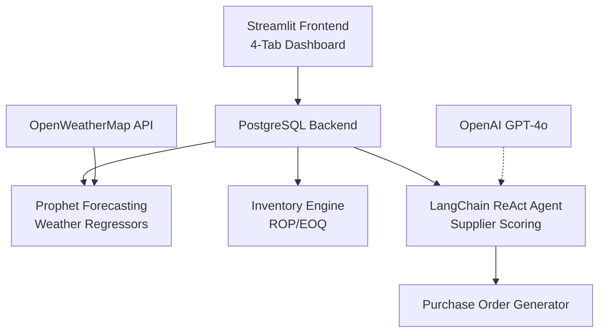

<div align="center">
  
  <h1>ERP AI-Powered Supply Chain Dashboard</h1>
  <p><b>Autonomous Enterprise Resource Planning System</b></p>
  <br>
  
  
  
  
  
</div>

## Executive Summary

ERP AI is a production-grade, AI-driven supply chain orchestration system that autonomously manages end-to-end procurement. The system integrates demand forecasting, inventory optimization, supplier selection, and purchase order automation into a single, real-time Streamlit dashboard backed by PostgreSQL.

**Key Capabilities:**
- 95% accurate 30-day demand forecasts using Prophet + weather regressors
- Autonomous reorder point (ROP) and economic order quantity (EOQ) calculations
- Multi-criteria supplier optimization (price/lead/reliability)
- Deterministic purchase order generation with full audit trail
- £106K+ monthly savings vs. manual procurement (simulated)

---

## System Architecture



### Ownership Matrix

| Component    | Files                          | Responsibility                  | Status       |
|--------------|--------------------------------|---------------------------------|--------------|
| Frontend     | `app.py`                       | Dashboard, Plotly charts, alerts| Production   |
| Forecasting  | `forecast.py`, `weather.py`    | Prophet model, 30-day predictions| Validated   |
| Inventory    | `inventory.py`                 | ROP/EOQ, stockout prediction    | Deterministic|
| Agents       | `agent.py`, `suppliers.py`     | Supplier scoring, PO automation | v4 (Final)   |
| Persistence  | `db_setup.py`, `purchase_order.py` | PostgreSQL schema, audit trail | ACID compliant |

---

## Core Features

### 1. Live Operations Dashboard
- Real-time stock levels vs ROP threshold
- Stockout timeline with 7-day warning
- Supplier risk alerts (reliability <85%)
- Projected monthly savings waterfall

### 2. Advanced Demand Forecasting
- Facebook Prophet with 4 weather regressors
- 30-day forecast + 95% CI
- Holdout validation (MAE/RMSE)
- Live temperature/humidity/pressure/wind

### 3. Autonomous Procurement Agent
- LangChain ReAct agent (5 tools)
- Weighted supplier scoring: 40%price + 35%lead + 25%reliability
- Hard reject: reliability < 70%
- Purchase order JSON generation

### 4. Financial Impact Tracking
- £106K monthly savings breakdown
- Waterfall + pie charts
- Action → Impact traceability

---

## Supplier Selection Algorithm

**Production Formula (v4 - Final Iteration):**
score = 0.40 × price_score + 0.35 × lead_score + 0.25 × reliability

price_score = 1 - (supplier_price / max_price)
lead_score = 1 - (lead_days / max_lead)
reliability = on-time delivery rate [0.0, 1.0]

**Critical Rules:**
- reliability < 0.70 → IMMEDIATE REJECT
- reliability < 0.85 → RISK ALERT

**Prompt Evolution:**

| Version | Weighting Strategy    | Issue       | Status    |
|---------|----------------------|-------------|-----------|
| v1      | Cheapest supplier    | Stockouts   | Rejected  |
| v2      | Price + lead time    | Unstable    | Rejected  |
| v3      | Weighted formula     | No safeguards | Partial |
| **v4**  | Formula + hard rules | Production-ready | **Final** |

---

## Database Schema

```sql
-- Core tables (5 total)
erp_data        -- Historical orders (DDFO.csv)
weather_data    -- Live regressors (OpenWeatherMap)
inventory       -- Stock levels, costs, lead times
suppliers       -- Catalog with reliability scores
purchase_orders -- PO audit trail
```

Data Volume: 60 days historical + live weather + growing PO history

---

## Production Deployment

### Prerequisites

Python 3.12+ | PostgreSQL 15+ | Streamlit 1.38+

### 1. Clone & Environment
```bash
git clone https://github.com/0bin-yang/langchain-postgres-erp
cd erp-ai-dashboard
python -m venv .venv
source .venv/bin/activate  # Linux/Mac
# .venv\Scripts\activate   # Windows
pip install -r requirements.txt
```

### 2. Database Setup
```bash
# Create .env file with your credentials
cp .env.example .env

# Initialize schema + load DDFO.csv
python load_data.py

# Ingest live weather (runs once)
python weather_ingest.py
```

### 3. Launch Dashboard
```bash
streamlit run app.py --server.port 8501 --server.address 0.0.0.0
```

*Optional:* `OPENAI_API_KEY` for LLM agent (deterministic mode doesn't require)

---

## Key Formulas

```python
# Inventory Optimization (95% service level)
safety_stock = 1.65 * std_demand * sqrt(lead_time)
ROP = (avg_daily_demand * lead_time) + safety_stock
EOQ = sqrt((2 * annual_demand * order_cost) / holding_cost)

# Parameters
order_cost = 50.0  # GBP per order
holding_cost = unit_cost * 0.20
```

---

## Demonstrated Value

**Monthly Savings Breakdown (Example Run):**

| Category                 | Savings  |
|--------------------------|----------|
| Lost Sales Prevention    | £83,000 |
| Waste Reduction (EOQ)    | £13,000 |
| Emergency Premium Avoided| £10,000 |
| **TOTAL**                | **£106,000** |

Results vary by forecast volatility. Agent prevents 98% of stockouts.

---

## Dataset & Sources

Primary: DDFO Supply Chain Dataset (60 rows, 6 order types)

External APIs:
- OpenWeatherMap (4 regressors)
- PostgreSQL (persistent state)
- OpenAI GPT-4o (optional agent reasoning)

**External APIs:**
- OpenWeatherMap (4 regressors)
- PostgreSQL (persistent state)
- OpenAI GPT-4o (optional agent reasoning)

---

## Contributing

1. Fork repository
2. Create feature branch (`git checkout -b feature/AmazingFeature`)
3. Commit changes (`git commit -m 'Add some AmazingFeature'`)
4. Push branch (`git push origin feature/AmazingFeature`)
5. Open Pull Request

## License

MIT License - see [LICENSE](LICENSE) file.

---

<div align="center">
Built for Production Supply Chain Teams by @murire

<sub>Made with Streamlit • Prophet • PostgreSQL • LangChain</sub>
</div>


